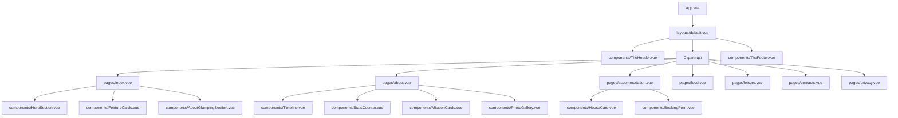

# План реализации сайта глэмпинга "Тропос"

## Архитектура проекта



## Этап 1: Настройка проекта и зависимостей

### 1.1 Установка и конфигурация пакетов

- **Tailwind CSS**: `@nuxtjs/tailwindcss`
- **PrimeVue**: `nuxt-primevue` с темой Lara Light
- **Анимации**: `@vueuse/motion` для scroll-triggered анимаций
- **Галерея**: `vue3-easy-lightbox` для lightbox функционала
- **Иконки**: `@nuxtjs/google-fonts` для шрифтов, PrimeIcons для иконок
- **Формы**: `vee-validate` + `yup` для валидации

### 1.2 Конфигурация [`nuxt.config.ts`](nuxt.config.ts)

```typescript
modules: [
  '@nuxtjs/tailwindcss',
  'nuxt-primevue',
  '@vueuse/motion/nuxt'
]
```

### 1.3 Создание [`tailwind.config.js`](tailwind.config.js)

Кастомизация цветовой палитры под дизайн:

- Основной цвет: черный (`#000000`)
- Акцентный: синий (`#B3C5FF`)
- Фоновый: светло-серый (`#F5F6FA`)

## Этап 2: Базовая структура и Layout

### 2.1 Layout [`layouts/default.vue`](layouts/default.vue)

- Общий layout со шапкой и футером
- Подключение анимаций при загрузке страниц

### 2.2 Навигация [`components/TheHeader.vue`](components/TheHeader.vue)

- Логотип (слева)
- Меню: ГЛАВНАЯ, СТРАНИЧАТЬ, ПРОЖИВАНИЕ, ПИТАНИЕ, ДОСУГ, КОНТАКТЫ
- Кнопка "Забронировать" (справа)
- Responsive меню для мобильных (PrimeVue Sidebar)
- Sticky header с эффектом при скролле

### 2.3 Футер [`components/TheFooter.vue`](components/TheFooter.vue)

- Левый блок: логотип, адрес, телефон, email
- Центральный блок: карта (iframe или PrimeVue GMap)
- Правый блок: форма "Я здесь" (Яндекс)
- Нижняя строка: копирайт, ссылки на политику конфиденциальности

## Этап 3: Переиспользуемые компоненты

### 3.1 [`components/BookingForm.vue`](components/BookingForm.vue)

- Поля: даты, количество гостей, имя, телефон, email
- Валидация через vee-validate
- API запрос на backend при отправке
- Обработка успеха/ошибок через PrimeVue Toast

### 3.2 [`components/RequestForm.vue`](components/RequestForm.vue)

- Упрощенная форма заявки
- Поля: имя, телефон
- Кнопка "Отправить"

### 3.3 [`components/HouseCard.vue`](components/HouseCard.vue)

- Галерея изображений с навигацией (стрелки)
- Название дома
- Описание
- Список удобств (bullets)
- Две кнопки: "Забронировать", "Подробнее"

### 3.4 [`components/StatsCounter.vue`](components/StatsCounter.vue)

- Анимированный счетчик (от 0 до значения)
- Срабатывает при появлении в viewport
- Используется на странице "О глэмпинге"

### 3.5 [`components/Timeline.vue`](components/Timeline.vue)

- Вертикальный таймлайн истории
- Карточки событий по годам
- Анимация появления при скролле

### 3.6 [`components/PhotoGallery.vue`](components/PhotoGallery.vue)

- Masonry/Grid layout изображений
- Клик открывает lightbox (vue3-easy-lightbox)
- Кнопка "Посмотреть все"

## Этап 4: Страницы

### 4.1 Главная [`pages/index.vue`](pages/index.vue)

**Секции:**

1. **Hero**: заголовок, подзаголовок, 2 кнопки
2. **Feature Cards**: 3 карточки (Семейный глэмпинг, Родительские молитвы, Природа)
3. **О глэмпинге**: текст + 3 фото карточки + кнопка "Подробнее"
4. **Молитвенная тропа**: текст + галерея (4-5 изображений)
5. **Важное о глэмпинге**: 3 карточки с текстом + кнопка "Забронировать"
6. **Контакты**: форма + карта

### 4.2 О глэмпинге [`pages/about.vue`](pages/about.vue)

**Секции:**

1. **Заголовок**: со статистикой (4 счетчика)
2. **История создания**: Timeline компонент
3. **Миссия глэмпинга**: 3 карточки миссий
4. **Фото галерея**: сетка изображений + lightbox
5. **Бронирование**: две формы (бронирование и заявка)

### 4.3 Проживание [`pages/accommodation.vue`](pages/accommodation.vue)

**Секции:**

1. **Заголовок**: со статистикой
2. **Список домов**: сетка HouseCard компонентов (6 домов)
3. **Бронирование**: формы внизу страницы

### 4.4 Питание [`pages/food.vue`](pages/food.vue)

- Заголовок секции
- Описание концепции питания
- Меню/блюда (карточки)
- Форма предзаказа питания

### 4.5 Досуг [`pages/leisure.vue`](pages/leisure.vue)

- Заголовок секции
- Описание активностей
- Карточки досуга (молитвенная тропа, прогулки, мастер-классы)
- Галерея фото

### 4.6 Контакты [`pages/contacts.vue`](pages/contacts.vue)

- Контактная информация
- Карта с местоположением (Яндекс.Карты или Google Maps)
- Форма обратной связи
- Реквизиты

### 4.7 Политика конфиденциальности [`pages/privacy.vue`](pages/privacy.vue)

- Статичная страница с текстом политики
- Простая типографика

## Этап 5: Анимации и UX

### 5.1 Scroll-triggered анимации

- Fade-in для всех секций при появлении
- Slide-up для карточек
- Stagger эффект для списков карточек
- Настройка через `@vueuse/motion`

### 5.2 Hover эффекты

- Карточки домов: легкий scale + shadow
- Кнопки: transition на background
- Изображения: легкий zoom

### 5.3 Transitions

- Page transitions между страницами
- Modal/Dialog появление для форм

## Этап 6: API интеграция

### 6.1 Composable [`composables/useBooking.ts`](composables/useBooking.ts)

```typescript
export const useBooking = () => {
  const submitBooking = async (data) => {
    // POST запрос на backend
  }
  return { submitBooking }
}
```

### 6.2 Composable [`composables/useRequest.ts`](composables/useRequest.ts)

Аналогично для формы заявок

## Этап 7: Адаптивность

### 7.1 Breakpoints (Tailwind)

- Mobile: `< 640px`
- Tablet: `640px - 1024px`
- Desktop: `> 1024px`

### 7.2 Адаптация компонентов

- Header: бургер-меню на мобильных
- Grid layouts: 1 колонка → 2 → 3
- Hero секция: текст центрирован на мобильных
- Формы: full-width на мобильных

## Этап 8: Оптимизация и финализация

### 8.1 Оптимизация изображений

- Настройка Nuxt Image модуля
- Lazy loading для изображений
- WebP формат

### 8.2 SEO

- Meta теги для всех страниц
- Open Graph теги
- Структурированные данные (JSON-LD)

### 8.3 Производительность

- Code splitting
- Prefetch для критических ресурсов
- Минификация CSS/JS

## Ключевые файлы для реализации

1. [`nuxt.config.ts`](nuxt.config.ts) - конфигурация проекта
2. [`tailwind.config.js`](tailwind.config.js) - настройки Tailwind
3. [`layouts/default.vue`](layouts/default.vue) - основной layout
4. [`components/TheHeader.vue`](components/TheHeader.vue) - шапка сайта
5. [`components/TheFooter.vue`](components/TheFooter.vue) - футер
6. [`components/HouseCard.vue`](components/HouseCard.vue) - карточка дома
7. [`pages/index.vue`](pages/index.vue) - главная страница
8. [`pages/accommodation.vue`](pages/accommodation.vue) - страница проживания

## Технологический стек

- **Framework**: Nuxt 3
- **Styling**: Tailwind CSS 3.x
- **UI Library**: PrimeVue 3.x
- **Animations**: @vueuse/motion
- **Lightbox**: vue3-easy-lightbox
- **Forms**: vee-validate + yup
- **API**: Nuxt $fetch / useFetch

## Примерная структура проекта

```
glamping/
├── app/
│   └── app.vue
├── assets/
│   └── css/
│       └── main.css
├── components/
│   ├── TheHeader.vue
│   ├── TheFooter.vue
│   ├── HeroSection.vue
│   ├── FeatureCards.vue
│   ├── HouseCard.vue
│   ├── BookingForm.vue
│   ├── RequestForm.vue
│   ├── StatsCounter.vue
│   ├── Timeline.vue
│   └── PhotoGallery.vue
├── composables/
│   ├── useBooking.ts
│   └── useRequest.ts
├── layouts/
│   └── default.vue
├── pages/
│   ├── index.vue
│   ├── about.vue
│   ├── accommodation.vue
│   ├── food.vue
│   ├── leisure.vue
│   ├── contacts.vue
│   └── privacy.vue
├── public/
│   └── images/
├── nuxt.config.ts
├── tailwind.config.js
└── package.json
```

## Порядок реализации

Этапы будут выполняться последовательно, начиная с настройки проекта и заканчивая оптимизацией. Приоритет отдается критическим страницам: Главная → Проживание → О глэмпинге → остальные.